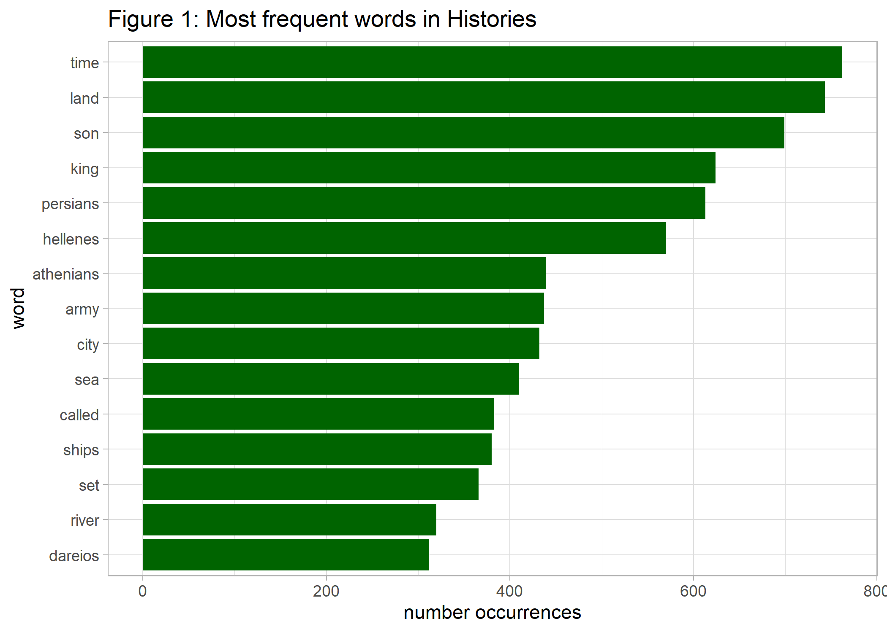
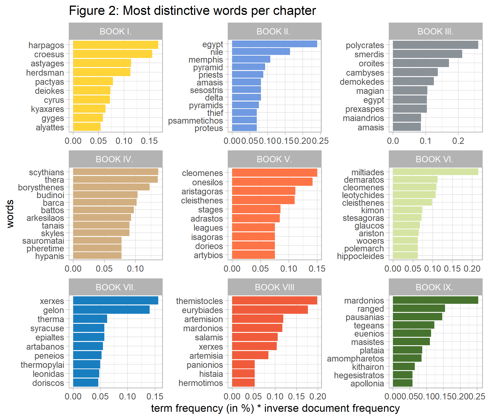
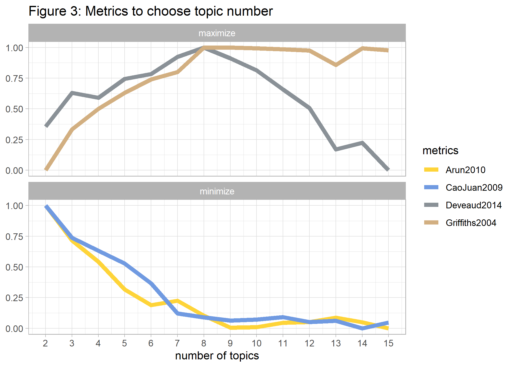
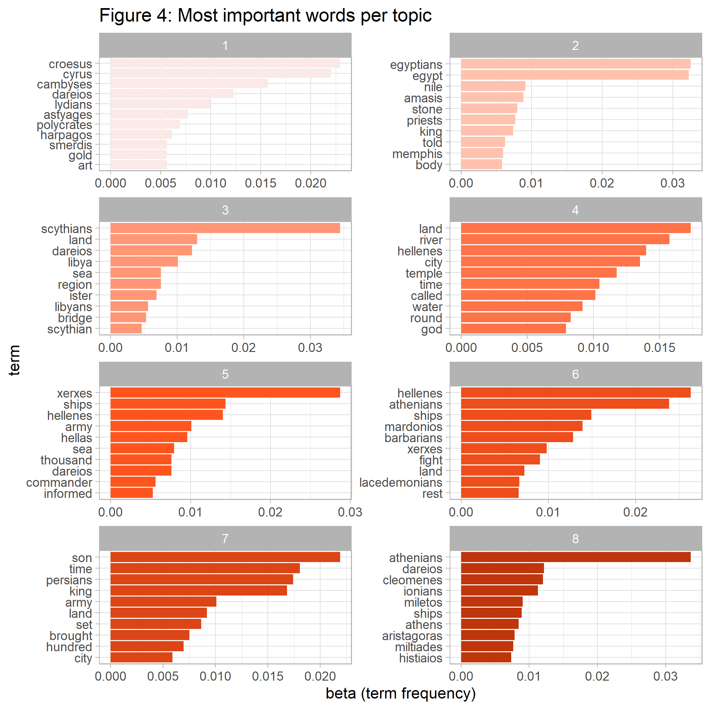
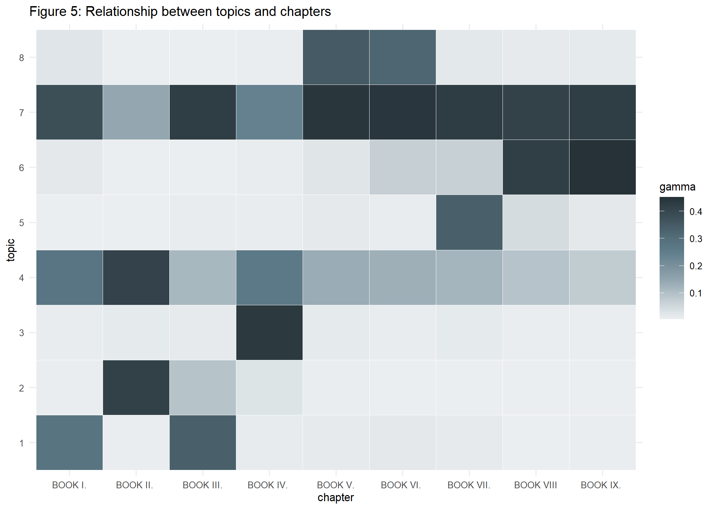
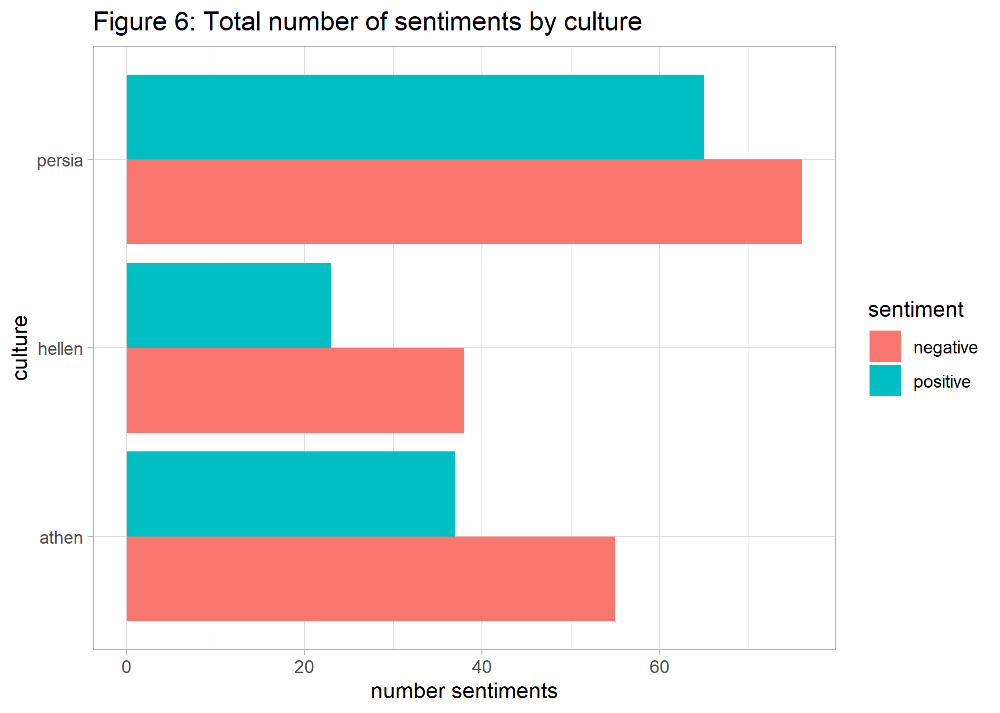

# Herodotus' Histories
## Florian Klohn, 21 May 2022


``` r
#Preliminaries:
knitr::opts_chunk$set(message=FALSE, warning=FALSE, eval = FALSE) #set eval = TRUE when run first

rm(list=ls())

library(tidyverse)
library(tidytext)
library(gutenbergr)
library(ggwordcloud)
library(topicmodels) 
library(ldatuning)
library(ggsci)

theme_set(theme_light())
```

## Introduction

*Herodotus* (484 – 425 BC), the first known author doing systematic
investigation of historical events, is famous for his important work on
the Greco-Persian wars: *Histories*, originally meaning ‘critical
inquiry,’ is therefore foundational to the Western historian tradition.
The text is so profound that it accompanied the well known journalist
and author Ryszard Kapuściński on his journeys across the globe. The
book is on my reading list for some time now.

However, probably due to its old age the book is not very easy to
digest. How can we use data science to have a first impression of the
book content? Fortunately, text mining tools are available for natural
language processing that can help us doing the job. Interesting sources
concerning text mining in R are eg.
[LADAL](https://slcladal.github.io/index.html) and [Automated Content
Analysis with R](https://content-analysis-with-r.com/index.html). Data
scientists interested in history may find [Programming
Historian](https://programminghistorian.org/en/lessons/) quite
illuminating. But now let us play a little bit with the text using
[tidytext](https://www.tidytextmining.com).

## Word Count

One first way to look at the ‘Histories’ is by using the number of
words. What are the most prevalent words in the book, after excluding
stop word (ie. irrelevant words)?

``` r
#Download data:
#gutenberg_metadata
#gutenberg_works(str_detect(title, "Herodotus"))
#hist_in <- gutenberg_download(c(2707, 2456))
#saveRDS(hist_in, "hist_gut.rds")
hist_in <- readRDS("hist_gut.rds")

#preparation: add chapter-information to data:
hist_df <- hist_in %>%
  arrange(desc(gutenberg_id)) %>%
  mutate(chapter=case_when(str_sub(text, 1, 5)=="BOOK " ~ str_sub(text, 1, 9), 
                           str_sub(text, 1, 8)=="NOTES TO" ~ str_sub(text, 1, 8))) %>%
  fill(chapter) %>%
  filter(str_sub(chapter, 1, 4)=='BOOK') %>% #removing footnotes
  mutate(line=row_number(), chapter=if_else(str_sub(chapter, 9,9)=='T', str_sub(chapter, 1,7), chapter),
         chapter=as_factor(chapter))

#tidy + clean data: exclude stop words + numbers
hist_tidy <- hist_df %>%
  unnest_tokens(word, text) %>% # -> tidy data
  anti_join(stop_words) %>% # exclude stop words
  filter(is.na(as.numeric(word))) %>% # exclude numbers
  filter(!word %in% c("thou", "thee", "thy", "ye")) #drop very frequent old words not detected by stop_words

#create wordcloud (as shown above):
set.seed(42)
hist_wordcloud <- hist_tidy %>%
  group_by(word) %>%
  summarize(num=n(), .groups="drop") %>%
  arrange(desc(num)) %>%
  slice(1:100) %>%
  mutate(angle = 90 * sample(c(0, 1), n(), replace = TRUE, prob = c(80, 20))) %>%
  ggplot(aes(label = word, size=num, angle=angle)) +
  geom_text_wordcloud(shape="square") + #, ylim=c(0,1), xlim=c(0.25, 0.85)
  theme_minimal() +
  scale_size_area(max_size = 15)
ggsave(hist_wordcloud, file="p0_hist_wordcloud.png") # import plot via markdown


#plot word count as bar char:
p1_hist_tidy <- hist_tidy %>%
  count(word, sort = TRUE) %>%
  filter(n > 300) %>%
  mutate(word = reorder(word, n)) %>%
  ggplot(aes(n, word)) +
  geom_col( fill='darkgreen') +
  labs(y = 'word', x='number occurrences', title='Figure 1: Most frequent words in Histories')
ggsave(p1_hist_tidy, file="p1_hist_tidy.png")  # import via markdown
```



We see that *time*, *land*, *son* and *king* are on the top of the list
followed by the main cultural players of the story – the *Persians* and
the Greek, represented by *Hellenes* and *Athenians*.

A more sophisticated approach of revealing representative document
words, is to focus on important words that are most distinctive to each
of the book’s 9 chapters. We do this by weighting the term frequency
(tf) with the inverse document frequency (idf).

``` r
hist_tf_idf <- hist_df %>%
  unnest_tokens(word, text) %>%
  group_by(chapter, word) %>%
  summarize(n=n()) %>% 
  bind_tf_idf(word, chapter, n) %>% #calculate inverse document frequency
  arrange(desc(tf_idf))

p2_hist_tf_idf <- hist_tf_idf %>%
  group_by(chapter) %>%
  slice_max(tf_idf, n = 10) %>%
  ungroup() %>%
  mutate(tf_idf=tf_idf*100, word=reorder_within(word, tf_idf, chapter)) %>% 
  ggplot(aes(x=tf_idf, y=word, fill = chapter)) + 
  geom_col(show.legend = FALSE) +
  scale_y_reordered() + #override ggplot default
  facet_wrap(~chapter, ncol = 3, scales = "free") +
  scale_fill_simpsons() +
  labs(x = "term frequency (in %) * inverse document frequency", y = 'words', title='Figure 2: Most distinctive words per chapter') 

ggsave(p2_hist_tf_idf, file="p2_hist_tf_idf.png") 
```



These most distinctive words per chapter show a strong emphasis on
geographical and biographical details, as expected in historical
literature. For example, the second book deals to large extent with
Egypt, which can easily seen by the top keywords.

## Topic Modeling

How can we access content of the book in a more meaningful way by using
abstract topics? We do so by applying *topic modeling*, a statistical
framework for unsupervised classification that discovers topics
occurring in a collection of documents (here: chapters). We use Latent
Dirichlet Allocation (LDA), a typical approach for topic modeling, in
order to automatically find both associations between words and the
topics, and associations between topics and the book’s nine chapters.
Although the number of topics are a priori unknown and serve as an input
for the algorithm, there are different approaches to automatically
determine the optimal number of topics. So let us first figure out the
relevant topic number at first.

``` r
#prepare data fro LDA
hist_dtm <- hist_tidy  %>%
  count(chapter, word) %>%
  cast_dtm(term=word, document=chapter, value=n)


ldatuning.metriken <- FindTopicsNumber(hist_dtm, topics = seq(from = 2, to = 15, by = 1), metrics = c("Griffiths2004", "CaoJuan2009", "Arun2010", "Deveaud2014"), method = "Gibbs", control = list(seed = 42), mc.cores = 2)

#What is the optimal number of topics to consider? Well, there are different ways to approach this problem, by maximizing dissimilarity between topics.

#Plot metrics:
#FindTopicsNumber_plot(ldatuning.metriken)

#use ggplot:
p3_top_num <- ldatuning.metriken %>% 
  pivot_longer(cols=c(Griffiths2004, CaoJuan2009, Arun2010, Deveaud2014), names_to='metrics') %>%
  group_by(metrics) %>%
  mutate(min_val=min(value), max_val=max(value), value_norm=(value-min_val)/(max_val-min_val)) %>%
  mutate(opt=case_when(metrics %in% c("CaoJuan2009", "Arun2010") ~ 'minimize', TRUE ~ 'maximize')) %>%
  ggplot(aes(x=topics, y=value_norm)) +
  geom_line(aes(color=metrics), size=2) + 
  scale_x_continuous(breaks = c(2:15)) +
  scale_color_simpsons() +
  facet_wrap(~ opt, ncol=1) +
  labs(y=NULL, x='number of topics', title="Figure 3: Metrics to choose topic number")
ggsave(p3_top_num, file="p3_top_num.png") 
```



Given criteria above we choose 8 as the number of topics in *Histories*
and use them as the input for our final LDA. The result will allow us to
extract the most distinctive words for each of the generated topics.

``` r
#LDA with 8 topics:
hist_lda <- LDA(hist_dtm, k = 8, control = list(seed = 42), method="Gibbs") 

#word topic association (beta):
topic_word <- tidy(hist_lda, matrix = "beta")

#visualize topics with top-10 word-probabilities per chapter
p4_topic_word <- topic_word %>%
  group_by(topic) %>%
  slice_max(beta, n = 10) %>%
  ungroup() %>%
  mutate(term=reorder_within(term, beta, topic)) %>% 
  ggplot(aes(x=beta, y=term,   fill = topic)) + 
  geom_col(show.legend = FALSE) +
  scale_y_reordered() + 
  scale_fill_material("deep-orange") + #cyan
  facet_wrap(~topic, ncol = 2, scales = "free") +
  labs(x = "beta (term frequency)", y = "term", title='Figure 4: Most important words per topic')

ggsave(p4_topic_word, file="p4_topic_word.png") 
```



One approach to understand the 8 topics is to look at their most
important words. We can see that topic 7 contains words such as ‘son,’
‘time,’ ‘king’ – words that are also most prevalent overall as shown
above. How are the 8 topics distributed over the nine chapters?

``` r
#Association between Documents & Themen: (gamma)
doc_topic <- tidy(hist_lda, matrix = "gamma") %>% 
  mutate(document=as_factor(document))

#visualize the assiciation between topics and chapter:
p5_doc_topic <- doc_topic %>%
  ggplot(aes(y=as.factor(topic), x=document,  fill=gamma)) + 
  scale_fill_material("blue-grey") +
  geom_tile(colour="white") +
  theme_minimal(base_size = 8) +
  labs(title="Figure 5: Relationship between topics and chapters", fill="gamma", y="topic", x="chapter")  

ggsave(p5_doc_topic, file="p5_doc_topic.png") 
```



A visual inspection suggests all chapters are a mixture of topic 4 and 7
+ some individual component. Whereas topic 7 captures ideas of ancestry,
topic 4 also contains words that are associated with religion. We also
see that the chapters 2-3 and 8-9 seem to have some overlap in their
content.

So far, we have used tools to figure out what the *Histories* are about.
According to Kapuściński (2007) the main theme of *Histories* can be
described by the form of following 3 rules, which governed antiquity, in
comparison with the modern world:

1.  The law of vengeance applies.
2.  Human happiness is not permanent.
3.  No one can escape fate, even not a god.

From today’s perspective these rules, especially 1 and 3, seem very
fatalistic, but they governed peoples life with cycles of crime and
punishment over a long period of time. If you know how to derive such an
interpretation with text mining methods, please let me know.

One last aspect worth discussing is the fact that Herodotus had a
Hellenian background. Was his description of the Persian-Greek conflict
culturally biased and how can data analytics support detecting this?

## Sentiment Analysis

In order to tackle this question we use a sentiment word lexicon in
which words are classified as positively or negatively. Are the terms
‘Persian,’ ‘Hellenic’ and ‘Athenian’ to the same extent associated with
positive/negative words in *Histories*?

As a first step we generate *bi-grams* (or word pairs), and extract
neighboring words of the terms *Persia*, *Hellen*, *Athen*, reflecting
different cultures. Then these neighboring words are matched with the
sentiment lexicon and the number of sentiments are summed up for each of
the 3 cultures.

``` r
#remove stop words before calculating bi-grams:
bg_herod <- hist_df %>%
  unnest_tokens(word, text) %>% 
  anti_join(stop_words) %>% # exclude stop words stop_words
  filter(is.na(as.numeric(word))) %>% # exclude numbers
  filter(!word %in% c("thou", "thee")) %>% #drop very frequent old words not detected by stop_words
  group_by(chapter, line) %>% #undo unnest words
  summarize(text = str_c(word, collapse = " ")) %>%
  ungroup() %>%
  unnest_tokens(bigram, text, token = "ngrams", n = 2)  %>% #nest n-grams
  count(bigram, sort = TRUE) 

#Which words are associated with the persian, greek or the athenian culture?
#dominate positive or negative sentiments?

#function to create bi-grams containing specific values:
cult_fct <- function(x) {

y <- bg_herod %>%
  filter(str_detect(bigram, x)) %>% #bi-grams containing "persian"
  separate(bigram, c("word1", "word2"), sep = " ") %>%
  mutate(culture=x, word1 = if_else(!str_detect(word1, x), word1, NA_character_ ),
         word2 = if_else(!str_detect(word2, x), word2, NA_character_ )) %>%
  unite(word1, word2, col=bigram, na.rm = TRUE) %>%
  filter(bigram!='')

return(y)

}


comp <- c('persia', 'hellen', 'athen')

#run function  
comp_cult <- comp %>%
  map(cult_fct) %>%
  bind_rows() 
 

#sentiment analysis:
sent_bing <- get_sentiments("bing") 

p6_comp_cult <- comp_cult %>%
  mutate(word=bigram) %>%
  inner_join(sent_bing, by="word") %>% 
  group_by(culture, sentiment) %>%
  summarize(n=sum(n)) %>%
  ggplot(aes(x=n, y=culture ,  fill = sentiment)) + 
  geom_bar(stat="identity", position = "dodge") +
  labs(x = "number sentiments", y = "culture", title='Figure 6: Total number of sentiments by culture')

ggsave(p6_comp_cult, file="p6_comp_cult.png") 
```



The results show that negative sentiments dominate all 3 cultures,
compared to positive ones. However, it is easy to see that in relation
to the total number of sentiments in each culture, the negative
sentiments are actually more pronounced for the terms *Hellenian* and
*Athenian*. So our results do not suggest that Herodotus’ Histories are
culturally biased in favor of the Greek culture.

## Wrap Up

We have seen how to use text mining tools together with visualization in
order to get a first impression of *The Histories*. In addition to
analyzing words, we have seen how to generate abstract topics from text
data. Also sentiment analysis was applied to see whether Herodotus’
description was positively biased towards the Greek culture.

Is the book worth reading after all? After mining *Histories* the book
will certainly stay on my reading list.

## References

<div id="refs" class="references csl-bib-body hanging-indent">

<div id="ref-gentzkow2019text" class="csl-entry">

Gentzkow, Matthew, Bryan Kelly, and Matt Taddy. 2019. “Text as Data.”
*Journal of Economic Literature* 57 (3): 535–74.

</div>

<div id="ref-topicm" class="csl-entry">

Grün, Bettina, and Kurt Hornik. 2011. “<span
class="nocase">topicmodels</span>: An R Package for Fitting Topic
Models.” *Journal of Statistical Software* 40 (13): 1–30.
<https://doi.org/10.18637/jss.v040.i13>.

</div>

<div id="ref-kapusc" class="csl-entry">

Kapuściński, Ryszard. 2007. *Travels with Herodotus*. Random House.

</div>

<div id="ref-wcloud" class="csl-entry">

Le Pennec, Erwan, and Kamil Slowikowski. 2019. *Ggwordcloud: A Word
Cloud Geom for ’Ggplot2’*.
<https://CRAN.R-project.org/package=ggwordcloud>.

</div>

<div id="ref-ldatune" class="csl-entry">

Nikita, Murzintcev. 2020. *Ldatuning: Tuning of the Latent Dirichlet
Allocation Models Parameters*.
<https://CRAN.R-project.org/package=ldatuning>.

</div>

<div id="ref-gutr" class="csl-entry">

Robinson, David. 2021. *Gutenbergr: Download and Process Public Domain
Works from Project Gutenberg*.
<https://CRAN.R-project.org/package=gutenbergr>.

</div>

<div id="ref-tidytext" class="csl-entry">

Silge, Julia, and David Robinson. 2016. “Tidytext: Text Mining and
Analysis Using Tidy Data Principles in r.” *JOSS* 1 (3).
<https://doi.org/10.21105/joss.00037>.

</div>

<div id="ref-ggsci" class="csl-entry">

Xiao, Nan. 2018. *Ggsci: Scientific Journal and Sci-Fi Themed Color
Palettes for ’Ggplot2’*. <https://CRAN.R-project.org/package=ggsci>.

</div>

</div>
